# PicoEMU Base Board 3bpp 版マニュアル

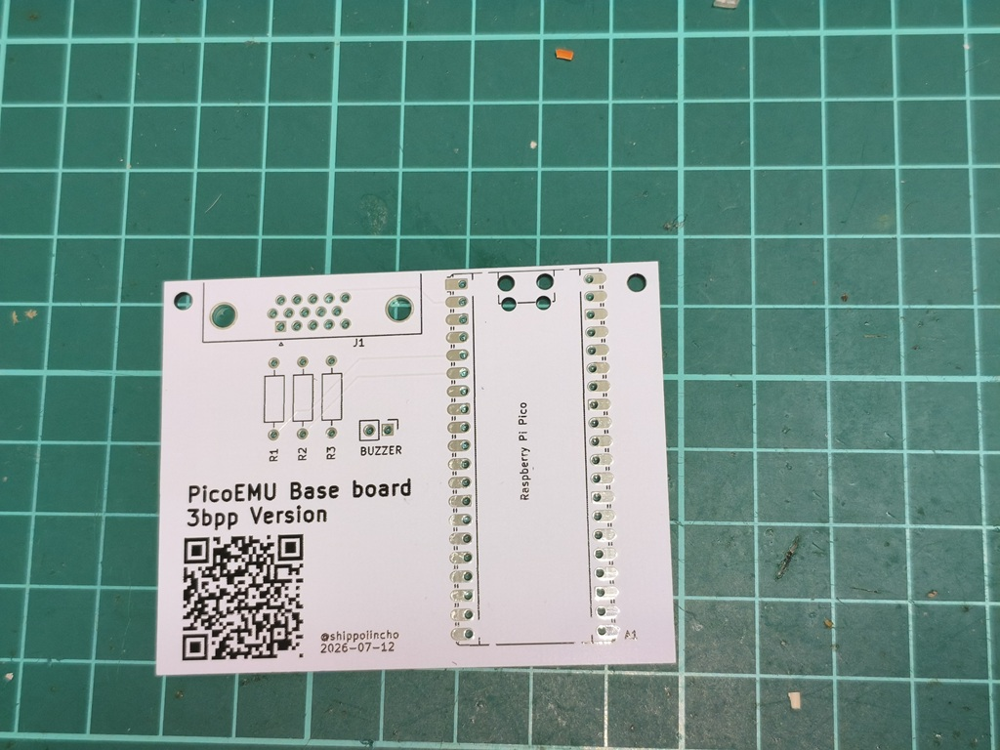

これは Raspberry Pi Pico を使ったエミュレータシリーズのうち、画面出力がデジタル8色の機種向けの基板マニュアルです。以下のエミュレータに対応しています。

- [FM-7](https://github.com/shippoiincho/fm7emulator)
- [BASIC Master Level 3](https://github.com/shippoiincho/bml3emulator)
- [MZ-1500](https://github.com/shippoiincho/mz1500emulator)
- [MZ-2000](https://github.com/shippoiincho/mz2000emulator)
- [Pasopia/Pasopia7](https://github.com/shippoiincho/pasopiaemulator)
- [JR-200](https://github.com/shippoiincho/jr200emulator)

6bpp（PC-6001）および8bpp（MSX）には対応していません。

## 必要なもの

- Raspberry Pi Pico（または互換機）

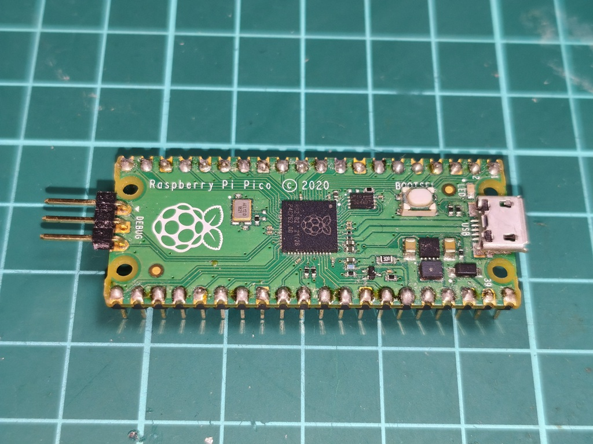

Raspberry Pi がリリースしているマイコンボードです。互換機には USB Micro‑B と USB‑C のコネクタを持つものがありますが、OTG ケーブルの都合上、USB Micro‑B タイプの使用をお勧めします。Raspberry Pi Pico 2（Pico 2）でも使えますが、ファームウェアのビルドが必要になります。

- 330Ω 抵抗

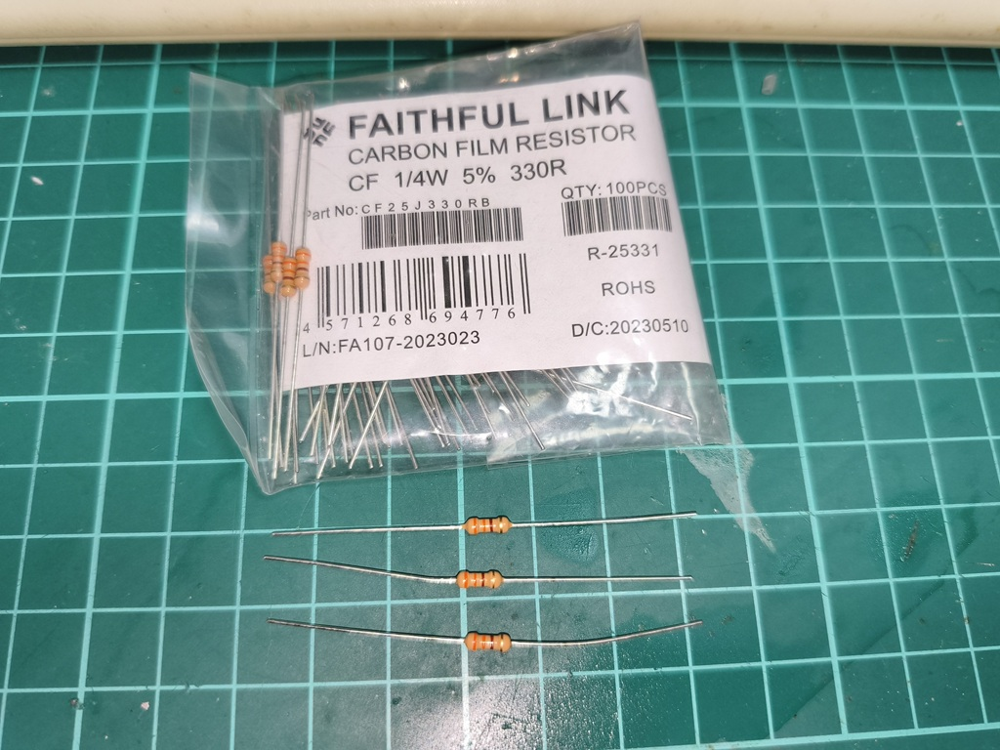

1/4W の抵抗です。秋葉原では秋月電子などで入手できます。

- VGA コネクタ

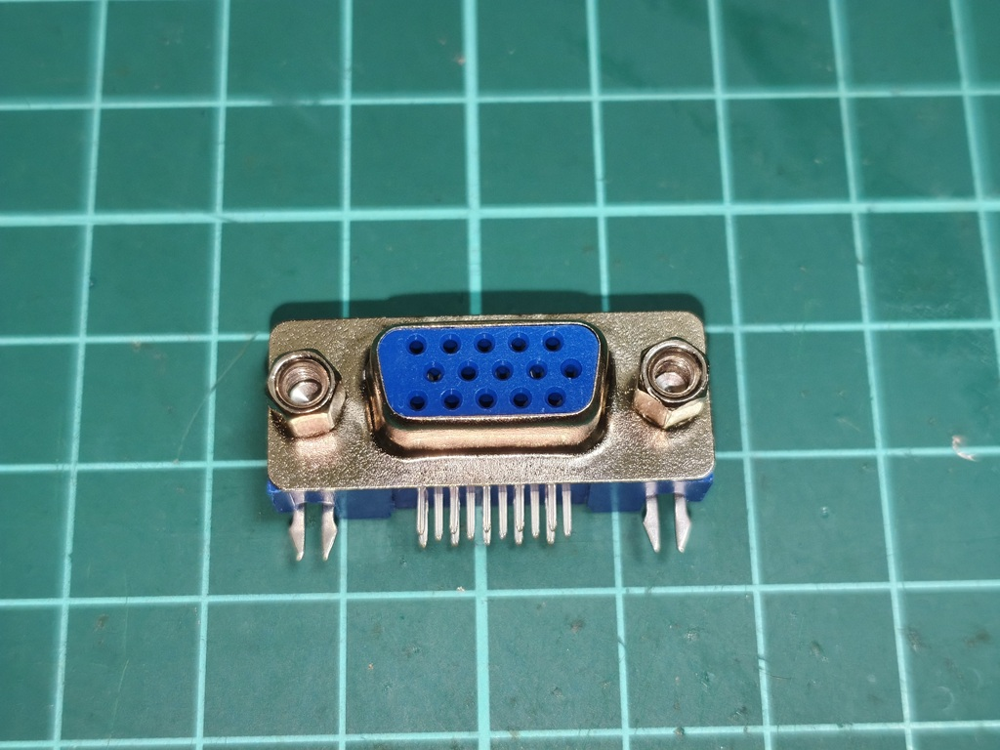

映像出力用のコネクタです。ピンの間隔が異なる製品がありますので、ご注意ください。秋葉原では [マルツで入手できる](https://www.marutsu.co.jp/pc/i/838015/)ようです。

- 圧電ブザー（圧電スピーカー）

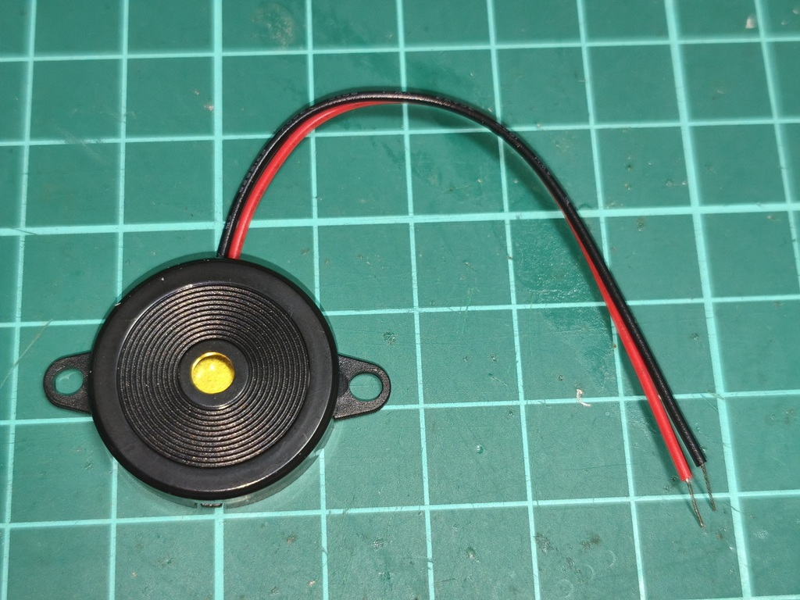

音を出すためのブザーです。秋月電子などで入手可能です（例: https://akizukidenshi.com/catalog/g/g101251/）。外励式（パッシブタイプ）を選んでください。同じ形状の電子ブザー（アクティブタイプ）は使用できませんのでご注意ください。

- OTG ケーブル

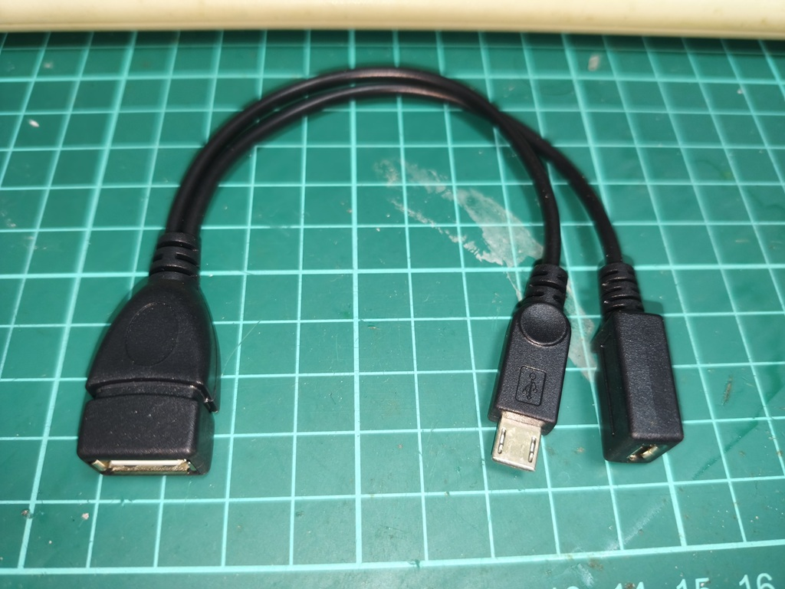

Pico の USB 端子にキーボードを接続するためのケーブルです。電源供給可能なものを選んでください。Amazon 等で入手可能です。なお、USB‑C タイプの OTG ケーブルは単純接続では給電されないことが多いため、対応する製品を慎重に選んでください。

- USB キーボード

市販の日本語 USB キーボードであれば概ね動作します。日本語以外のキーボードを接続した場合、一部のキーが使用できないことがあります。

- ディスプレイ

VGA 入力端子を持つディスプレイが必要です。なければ VGA→HDMI 変換器などで変換してください。

- パソコン

ファームウェアやソフトの書き込みにパソコンが必要です。できれば Windows を推奨します。

- 工具など

はんだごてなど電子工作用の工具が必要です。

## 作り方

特に難しいことはないと思います。以下のように作成します。

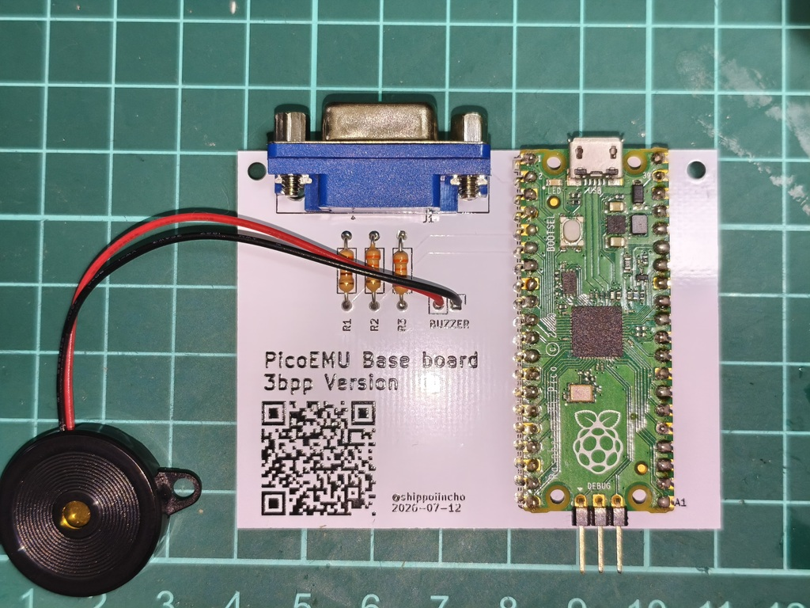

- 純正 Pico は端面端子を使って直接はんだ付けができるようになっていますが、ピンヘッダを介してはんだ付けすることをお勧めします。  
- Pico を取り外したい場合には、ピンソケットを使用してください。

## 使い方（例）

ここでは MZ-1500 エミュレータを例に環境を作成します。多くのエミュレータでは実機から取得した ROM データが必要ですが、MZ-700 では互換 ROM やソフトウェアをインターネットから無償で入手できるため、実機のデータがなくても動作させることができます。

- ファームウェアの書き込み

[MZ-1500 エミュレータのページ](https://github.com/shippoiincho/mz1500emulator)から `mz700emulator.uf2` をダウンロードします。Pico の BOOT ボタンを押しながらパソコンに接続すると書き込みモードになり、パソコンからは USB ドライブとして見えるようになります。その USB ドライブにダウンロードしたファイルをコピーすると Pico に書き込まれます。

なお、Pico 2 や Pico W / Pico 2 W を使う場合は、ファームウェアのビルド（pico-sdk 環境の構築など）が必要になります（ここでは割愛します）。

- フォントと ROM の準備

[MZ-700win](https://mzakd.cool.coocan.jp/starthp/mz700win.html) の説明に従ってフォントを作成してください。同様に MZ-NEWMON もダウンロードします。

- フォントと ROM の書き込み

[pico-sdk-tools の Release](https://github.com/raspberrypi/pico-sdk-tools) から、お使いの PC の OS に対応した `picotool` をダウンロードします。Windows の場合は例として `picotool-2.3.0-x64-win.zip`（執筆時点のバージョン）があります。

この picotool を用いて、ROM とフォントを書き込みます。picotool を実行する前に Pico を書き込みモードにしてください。書き込みモードになったらコマンドプロンプト等で以下を実行します（picotool の実行ファイルがあるディレクトリで作業すると楽です）。一度書き込むと書き込みモードが解除されるので、再度書き込みモードにしてから続けてください。

```
picotool load -v -x NEWMON7.ROM -t bin -o 0x10070000
picotool load -v -x mz700fon.dat -t bin -o 0x10074000
```

- 実行テスト

ここまで準備できていればエミュレータは動作しているはずです。試しに実行してみます。

-- VGA コネクタをディスプレイに接続します。  
-- OTG ケーブルに電源用 USB ケーブルとキーボードを接続し、それを Pico の USB 端子に接続します。

正しく動作していれば以下のような画面が表示されます。

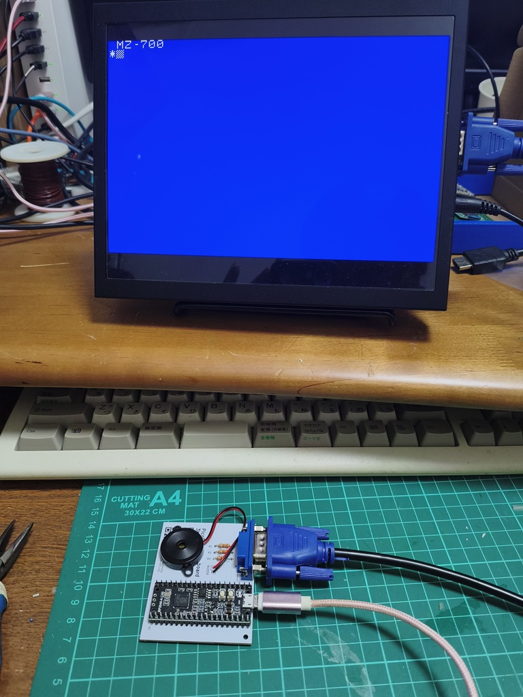

また、キーボードの F12 を押すとメニュー画面が表示されます。

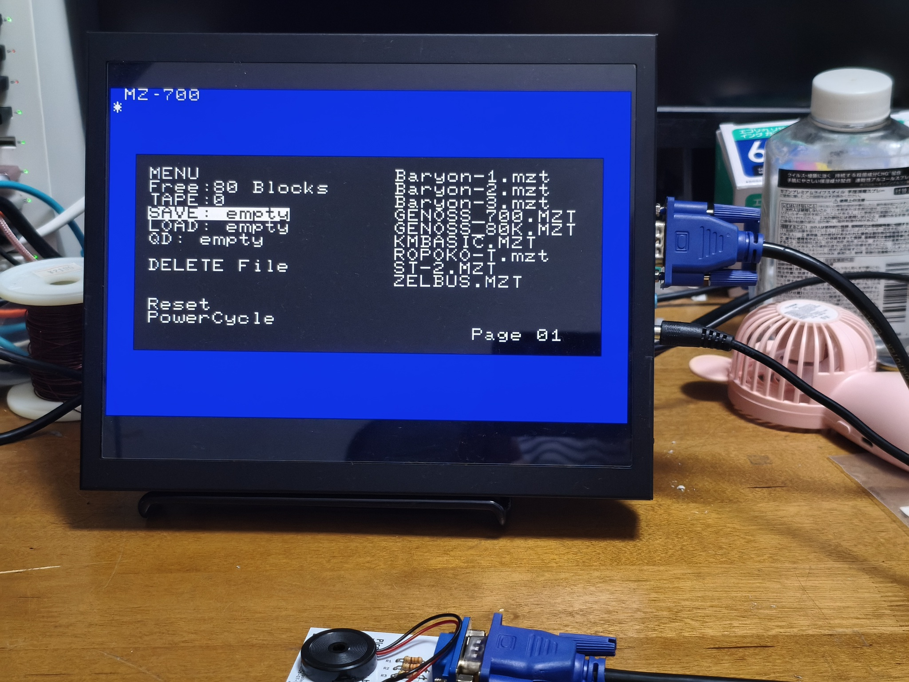

もしここまで正しく動作していない場合は、ファームウェアや ROM イメージの書き込みに失敗している可能性があるため、手順を見直して再度書き込みを行ってください。

- ソフトウェアの準備

MZ-700 には BASIC 等が標準搭載されていないため、ソフトウェアは通常テープで供給されます。エミュレータでは一般的な `MZT` 形式のファイルに対応しています。インターネット上で入手可能なフリーソフトがいくつかあります。

ここでは例として [Hu-BASIC 互換 BASIC](https://000.la.coocan.jp/mz700/index.html) を使う手順を示します。

- LittleFS イメージの作成

入手した `.mzt` ファイルをまとめて LittleFS イメージを作成します。作成には [mklittlefs](https://github.com/earlephilhower/mklittlefs) を使用します。例として、`mz700` フォルダ以下にある MZT ファイルをまとめて LittleFS イメージを作成するには次のようにします。

```
mklittlefs -b 4096 -s 1572864 -c mz700 picoemu.img
```

ファイル名に制限があるため、長いファイル名は 16 文字以内に変更してください。

- LittleFS イメージの書き込み

作成したイメージは ROM データと同様に picotool 等で書き込みます。

```
picotool load -v -x picoemu.img -t bin -o 0x10080000
```

正しく書き込まれていれば、メニュー画面上で書き込んだイメージファイルが表示されます。

- テープイメージのロード

NEW‑MONITOR の画面で `L`（Enter）を入力します。エミュレータがテープからロードするモードに入るので、メニューの `LOAD` を選択し、テープファイル（`basic.mzt`）を選択します。

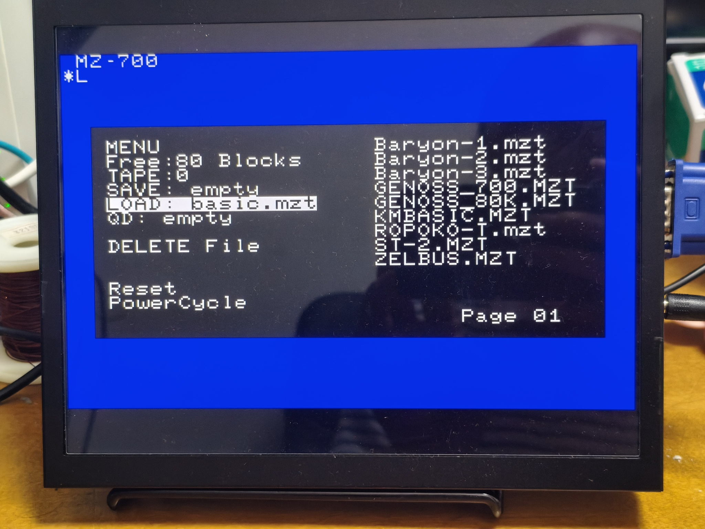

正しくロードできれば次のような画面になります。

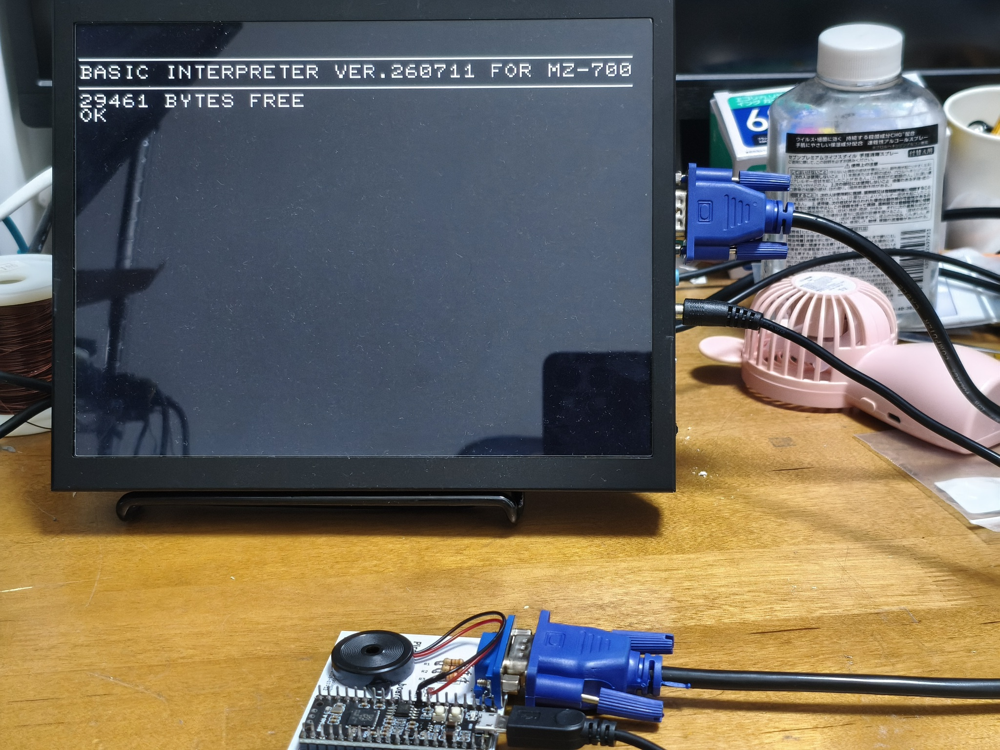

ロードが完了すると BASIC が起動します。昭和時代のパソコン環境がここに再現されます。

## 改造など

- 音声出力はブザーを前提にしていますが、外部に追加したローパスフィルタ（LPF）回路を経由してライン入力に接続することも可能です。  
- ケースなどは市販のケースを利用できます。1/3 サイズで作られているので余裕をもって内蔵できると思います.
